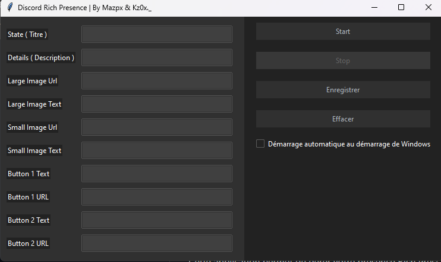

# Discord Rich Presence App

[](https://mega.nz/folder/RJlmBA5S#gaDaf6nEsdp3PrBVgU2Q9Q)

## Description
Cette application permet de gérer votre présence Rich Presence sur Discord de manière personnalisée. Vous pouvez définir le titre, la description, les images grandes et petites, ainsi que des boutons avec des liens associés. L'application se connecte à Discord via l'API de Rich Presence pour mettre à jour votre statut de manière dynamique.

## Fonctionnalités

- **Personnalisation avancée :** Définissez votre titre, description, images et boutons.
- **Démarrage automatique :** Option pour démarrer automatiquement avec Windows.
- **Enregistrement des données :** Les données sont sauvegardées localement pour une utilisation future.

## Captures d'écran



## Installation

### Prérequis
- Python 3.x
- Modules requis : `tk`, `pypresence`, `ttkbootstrap`, `presence`

### Étapes d'installation
1. Clonez ce dépôt GitHub :
   ```bash
   git clone https://github.com/kzoxmazpx/RPC_BY_Mazpx.git
